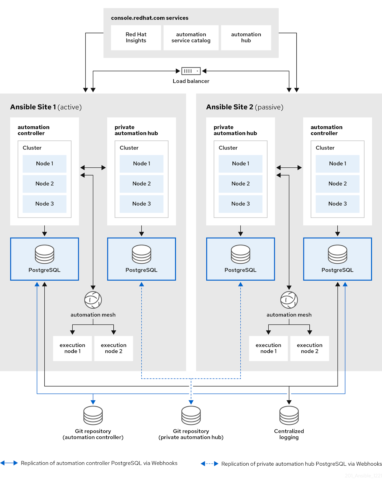
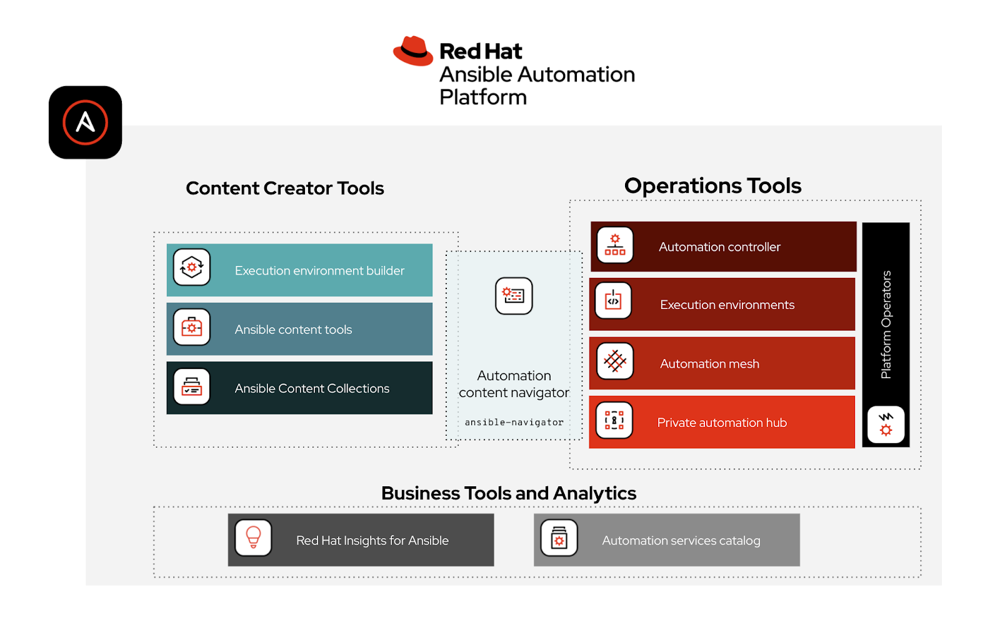

[[Index]]

https://www.redhat.com/en/interactive-labs

  

#### A recap: Ansible Automation Platform 2 component overview

Ansible Automation Platform 2 introduced an entire suite of tools and components that enables enterprises to scale automation across their organizations. Ansible Automation Platform is no longer just an upstream command line Ansible package with support, nor is the platform simply just a graphical user interface for Ansible. Let's look at a high level diagram that details the different components available:

  
There are a lot of components besides just the well known “ansible-*” binary command line tools. Red Hat has developed multiple components to help customers create, manage and scale their automation. Let’s break these down and highlight what has been released!

**Execution environment builder** ([documentation](https://access.redhat.com/documentation/en-us/red_hat_ansible_automation_platform/2.1/html/ansible_builder_guide))**:** This is a command line tool that helps automation creators quickly package together their automation into containerized images called automation execution environments .

**Ansible content tools:** This refers to fully supported components that help people create automation content. For example, the command line tool “ansible-test” helps IT automators test their automation content ([documentation](https://docs.ansible.com/ansible/latest/dev_guide/testing.html#developing-testing)). We’re working towards adding full support for the [Ansible VS code extension](https://www.ansible.com/resources/webinars-training/using-new-vs-code-extension-for-ansible), as well as other creator tools.

**Ansible Content Collections:**  With Ansible Automation Platform 2, we have disaggregated automation content (roles, playbooks, modules, plugins, etc.) from the execution component ansible-core (e.g. ansible-playbook, etc). A good analogy for this is that I don’t have to upgrade my phone to grab the newest version of my favorite mobile game. By disaggregating automation content, it allows us to asynchronously release Ansible Content Collection updates and continually improve automation. If you need help on understanding what a Collection is, check out this [YouTube video](https://www.youtube.com/watch?v=WOcqhk7TdYc). We have continually added new automation content for multiple domains, including:

-   Infrastructure ([Red Hat](https://console.redhat.com/ansible/automation-hub/repo/published/redhat/), [Windows](https://console.redhat.com/ansible/automation-hub/repo/published/ansible/windows))
-   Cloud Native ([Kubernetes](https://console.redhat.com/ansible/automation-hub/repo/published/kubernetes/core) and [Red Hat OpenShift](https://console.redhat.com/ansible/automation-hub/repo/published/redhat/openshift))
-   Public Cloud ([AWS](https://console.redhat.com/ansible/automation-hub/repo/published/amazon/aws), [Azure](https://console.redhat.com/ansible/automation-hub/repo/published/azure), [GCP](https://console.redhat.com/ansible/automation-hub/repo/published/google/cloud))
-   Private Cloud ([VMware](https://console.redhat.com/ansible/automation-hub/repo/published/vmware))
-   Network Automation ([Arista, Cisco, Juniper, Vyos](https://console.redhat.com/ansible/automation-hub/repo/published/ansible/network))
-   Security Automation ([Checkpoint](https://console.redhat.com/ansible/automation-hub/repo/published/check_point), [Cisco](https://console.redhat.com/ansible/automation-hub/repo/published/cisco/asa), [IBM](https://console.redhat.com/ansible/automation-hub/repo/published/ibm/qradar))

You can check out all the certified and fully supported Collections on [Ansible automation hub on console.redhat.com](https://console.redhat.com/ansible/automation-hub).

**Automation content navigator** ([documentation](https://access.redhat.com/documentation/en-us/red_hat_ansible_automation_platform/2.1/html/ansible_navigator_creator_guide/index)): A new command-line component for automation creators that includes an interactive text-based user interface (TUI).  Automation content navigator (ansible-navigator) allows Ansible experts to easily reuse their operational knowledge of traditional Ansible commands and methodologies (e.g. ansible-playbook) with support for automation execution environments. Automation content navigator also allows the ability to quickly zoom in and out of plays and filter output on the fly, enhancing the play recap experience that automation engineers have come to know and love.  I also highly recommend watching my colleague’s YouTube video [Authoring content quickly using ansible-navigator](https://youtu.be/Upisw3Pv294).

**Automation controller** ([documentation](https://docs.ansible.com/automation-controller/latest/html/administration/index.html)): the Web User Interface (webUI) and API (Application Programming Interface) for Ansible Automation Platform. This replaces the component formerly known as Red Hat Ansible Tower. However, it goes above and beyond the old architecture by decoupling the control plane and execution plane so the execution capacity is no longer tied to the same node as the graphical interface. For more information on this architectural change, I recommend reading Craig Brandt’s blog post, [What's new in Ansible Automation Platform 2: automation controller](https://www.ansible.com/blog/whats-new-in-ansible-automation-platform-2-automation-controller).

**Automation execution environments** ([documentation](https://access.redhat.com/documentation/en-us/red_hat_ansible_automation_platform/)): Simply put, these are container images that can be utilized as Ansible control nodes. They contain the Python package dependencies (e.g. boto3 for Amazon Web Services), [system level dependencies](https://docs.opendev.org/opendev/bindep/latest/readme.html) (e.g. Linux packages gcc, jq) and Ansible Content Collections bundled with a version of ansible-core to create a self-contained runtime environment for your Ansible Playbooks. Both command-line ansible-navigator and the WebUI/API driven automation controller can perform execution environments, making it easier to go from creating and testing your automation playbooks to operatilizing and putting them into production quicker and more effortlessly. For more information on automation execution environments, please check out the blog post, [What’s new in Ansible Automation Platform 2: automation execution environments](https://www.ansible.com/blog/whats-new-in-ansible-automation-platform-2-automation-execution-environments).

**Private automation hub** ([documentation](https://access.redhat.com/documentation/en-us/red_hat_ansible_automation_platform/2.1/html/managing_red_hat_certified_and_ansible_galaxy_collections_in_automation_hub/index)): Allows automation creators to collaborate and publish their own automation content and streamline Ansible code within their own organizations. Organizations can now manage and control the lifecycle of their Ansible content as their needs scale across the hybrid cloud. This component is completely self-hosted and can service both Ansible Content Collections and execution environments to automation creators and operators. I encourage you to read [my blog on private automation hub](https://www.ansible.com/blog/whats-new-in-ansible-automation-platform-2-private-automation-hub) for a deep dive. 

**Automation hub** ([console](https://console.redhat.com/ansible/ansible-dashboard)): This is the counterpart to private automation hub. This is a publicly hosted and curated automation content repository on console.redhat.com for all the fully supported and certified Ansible Content Collections. IT Operators can sync specific Collections from Ansible automation hub to their on-premises private automation hub and control which content they want to use.

**Red Hat Insights for Ansible Automation Platform** ([console](https://console.redhat.com/ansible/insights/reports) and [product page](https://www.ansible.com/products/insights-for-ansible)): This optional hosted service is available on console.redhat.com. It allows automation architects to aggregate data from multiple Ansible Automation Platform clusters to a single visual dashboard, so architects can analyze and discover trends across multiple automation initiatives. Red Hat Insights for Ansible Automation Platform is a hosted service constantly adding new features and abilities asynchronous from Ansible Automation Platform. However, there is a new feature coinciding with 2.1, called reports. Reports offer analytical data and downloadable PDFs for consumption. For example, you can see which hosts were changed by which job template over time, hosts broken down by organizations, jobs and tasks broken out by organization, and more. 

**Automation services catalog** ([console](https://console.redhat.com/ansible/catalog/products)): Another hosted service on console.redhat.com included in your Ansible Automation Platform subscription. Automation services catalog acts as a lightweight IT service management, where automation consumers can order automation as catalog items. Automation services catalog allows you to aggregate multiple automation controllers into a single push-button WebUI abstracting any site-specific complexity. This allows new personas to adopt automation in a consumable turn-key fashion across your organization.  It also has approvals and checkout systems, adding a level of governance to your enterprise automation.

**Ansible Automation Platform Operator** ([documentation](https://access.redhat.com/documentation/en-us/red_hat_ansible_automation_platform/2.1/html/red_hat_ansible_automation_platform_operator_installation_guide/index)): A native and fully supported Operator for Red Hat OpenShift, allowing easy installation of Ansible components onto Red Hat OpenShift through Operator Hub. Both automation controller and private automation hub are included in a single consumable operator.  Watch this in action in our light hearted series, [Automated Live, Episode 03](https://youtu.be/nl9Wc6kw8qc?t=327) (skip to 5:29). 


*** AWX is the freeware version of AAP -> Use for home testing


## Syntax Check

  
  

```bash
[student@workstation playbook-multi]$ ansible-navigator run \

> -m stdout intranet.yml --syntax-check

playbook: /home/student/playbook-multi/intranet.yml

  
   Run the playbook using the ansible-navigator run command. Read through the

generated output to ensure that all tasks completed successfully. Verify that an HTTP GET

request to http://servera.lab.example.com provides the correct content.

10.1. Run the playbook using the ansible-navigator run command.


```


  

## Running Playbook

  
```bash
[student@workstation playbook-multi]$ ansible-navigator run \

> -m stdout intranet.yml

PLAY [Enable intranet services] ************************************************

TASK [Gathering Facts] *********************************************************

ok: [servera.lab.example.com]

TASK [Latest version of httpd and firewalld installed] *************************

changed: [servera.lab.example.com]

TASK [Test html page is installed] *********************************************

changed: [servera.lab.example.com]

TASK [Firewall enabled and running] ********************************************

changed: [servera.lab.example.com]

TASK [Firewall permits access to httpd service] ********************************

changed: [servera.lab.example.com]

TASK [Web server enabled and running] ******************************************

changed: [servera.lab.example.com]

PLAY [Test intranet web server] ************************************************

TASK [Gathering Facts] *********************************************************


```


  

## Checking Playbook

  
```bash
[student@workstation troubleshoot-host]$ ansible-navigator run \

> -m stdout mailrelay.yml --check

PLAY [Create mail relay servers] ***********************************************

...output omitted...

TASK [Check main.cf file] ******************************************************

ok: [servera.lab.example.com]

TASK [Verify main.cf file exists] **********************************************

ok: [servera.lab.example.com] => {

 "msg": "The main.cf file exists"

}

...output omitted...

TASK [Start and enable mail services] ******************************************

fatal: [servera.lab.example.com]: FAILED! => {"changed": false, "msg": "Could not

 find the requested service postfix: host"}


```


  
  

## Troubleshooting Errors with verbosity

```bash
[student@workstation troubleshoot-host]$ ansible-navigator run \

> -m stdout -vvvv samba.yml

ansible-playbook [core 2.13.0]

 config file = /home/student/troubleshoot-host/ansible.cfg

 configured module search path = ['/home/runner/.ansible/plugins/modules', '/usr/

share/ansible/plugins/modules']

 ansible python module location = /usr/lib/python3.9/site-packages/ansible

 ansible collection location = /home/runner/.ansible/collections:/usr/share/

ansible/collections

 executable location = /usr/bin/ansible-playbook

 python version = 3.9.7 (default, Sep 13 2021, 08:18:39) [GCC 8.5.0 20210514 (Red

 Hat 8.5.0-3)]


```

`ansible-navigator` also has the Text User Interface (TUI) which will help you to visualize the Ansible execution better than the `ansible-playbook` command.

  

```

$ ansible-navigator run site.yaml

```

  

## Installing ansible-navigator

  

Ansible navigator can be installed using multiple methods as follows.

  

```bash

## Using Python

$ python3 -m pip install ansible-navigator --user

  

## Using package manager on RHEL

## A subscription is required

$ dnf install \

  --enablerepo=ansible-automation-platform-2.2-for-rhel-8-x86_64-rpms \

  ansible-navigator

```

  

Refer to the navigator **[installation document](https://ansible-navigator.readthedocs.io/en/latest/installation)** or the **[Red Hat documentation](https://access.redhat.com/documentation/en-us/red_hat_ansible_automation_platform/2.2/html/ansible_navigator_creator_guide/assembly-installing_on_rhel_ansible-navigator)** to learn more.

  

## ansible-playbook to ansible-navigator

  

The changes are very easy to adopt and commands are self-explanatory subsets.

  

| Old individual commands | ansible-navigator subcommands |

| --- | --- |

| `ansible-playbook` | `ansible-navigator run` |

| `ansible-doc` | `ansible-navigator doc` |

| `ansible-config` | `ansible-navigator config` |

| `ansible-inventory` | `ansible-navigator inventory` |

  

## ansible-navigator –help

  

`ansible-navigator --help` will show the details help page of `ansible-navigator` utility including the options, arguments and subcommands to available.

  

```

$ ansible-navigator --help

usage: ansible-navigator [-h] [--version] [--rad ANSIBLE_RUNNER_ARTIFACT_DIR] [--rac ANSIBLE_RUNNER_ROTATE_ARTIFACTS_COUNT] [--rt ANSIBLE_RUNNER_TIMEOUT]

                         [--cdcp COLLECTION_DOC_CACHE_PATH] [--ce CONTAINER_ENGINE] [--dc DISPLAY_COLOR] [--ecmd EDITOR_COMMAND] [--econ EDITOR_CONSOLE]

                         [--ee EXECUTION_ENVIRONMENT] [--eei EXECUTION_ENVIRONMENT_IMAGE]

                         [--eev EXECUTION_ENVIRONMENT_VOLUME_MOUNTS [EXECUTION_ENVIRONMENT_VOLUME_MOUNTS ...]] [--la LOG_APPEND] [--lf LOG_FILE] [--ll LOG_LEVEL] [-m MODE]

                         [--osc4 OSC4] [--penv PASS_ENVIRONMENT_VARIABLE [PASS_ENVIRONMENT_VARIABLE ...]] [--pp PULL_POLICY]

                         [--senv SET_ENVIRONMENT_VARIABLE [SET_ENVIRONMENT_VARIABLE ...]]

                         {subcommand} --help ...

  

optional arguments:

  -h, --help            show this help message and exit

...output omitted...

  

```

  

## ansible-navigator -The TUI Dashboard

  

`ansible-navigator welcome` will show the text user interface (TUI) of Ansible Navigator with instructions and subcommands. (You will get the same interface when you execute `ansible-navigator` without any arguments)

  


  

You can execute the subcommands from the same TUI like a dashboard.

  

### :doc -Checking documentation

  

```

:doc dnf

```

  

It will load the result in the same TUI interface.

  

```

DNF (MODULE)                                                                                                      

  0│---                                                                                                          

  1│doc:                                                                                                          

  2│  author:

  3│  - Igor Gnatenko (@ignatenkobrain) <i.gnatenko.brain@gmail.com>

  4│  - Cristian van Ee (@DJMuggs) <cristian at cvee.org>

  5│  - Berend De Schouwer (@berenddeschouwer)

  6│  - Adam Miller (@maxamillion) <admiller@redhat.com>

  7│  collection: ansible.builtin

  8│  description:

  9│  - Installs, upgrade, removes, and lists packages and groups with the I(dnf) package

 10│    manager.

 11│  filename: /usr/lib/python3.8/site-packages/ansible/modules/dnf.py

 12│  has_action: false

 13│  module: dnf

 14│  notes:

 15│  - When used with a `loop:` each package will be processed individually, it is much

 16│    more efficient to pass the list directly to the `name` option.

 17│  - Group removal doesn't work if the group was installed with Ansible because upstream

 18│    dnf's API doesn't properly mark groups as installed, therefore upon removal the

 19│    module is unable to detect that the group is installed (https://bugzilla.redhat.com/show_bug.cgi?id=1620324

...output omitted...

```

  

We can also use the execution environment here and see the documentation from included content as follows.

  

```

$ ansible-navigator doc -l -eei ee-supported-rhel8 -

```

  

### :run – Execute the playbook

  

```

:run site.yml

```

  

### :quit – Exit from ansible-navigator

  

You can go back to the previous window at any time by pressing the Esc button. You can exit from the TUI at any time by `Esc` followed by `:q` (or `:quit`)

  

## ansible-navigator Subcommands

  

Subcommands are available to use and replace old `ansible-*` utilities (eg: `ansible-playbook`, `ansible-config` etc).

  

```

Subcommands:

  {subcommand} --help

    collections         Explore available collections

    config              Explore the current ansible configuration

    doc                 Review documentation for a module or plugin

    images              Explore execution environment images

    inventory           Explore an inventory

    replay              Explore a previous run using a playbook artifact

    run                 Run a playbook

    welcome             Start at the welcome page

```

  

### ansible-navigator config

  

List and explore the current ansible configuration.

  

```

$ ansible-navigator config

```

  

```

    OPTION                        DEFAULT SOURCE  VIA     CURRENT VALUE

  0│ACTION_WARNINGS                  True default default True                                                    

  1│AGNOSTIC_BECOME_PROMPT           True default default True

  2│ALLOW_WORLD_READABLE_TMPFILES    True default default False

  3│ANSIBLE_CONNECTION_PATH          True default default None

  4│ANSIBLE_COW_ACCEPTLIST           True default default ['bud-frogs', 'bunny', 'cheese', 'daemon', 'default', 'd

  5│ANSIBLE_COW_PATH                 True default default None

  6│ANSIBLE_COW_SELECTION            True default default default

  7│ANSIBLE_FORCE_COLOR              True default default False

  8│ANSIBLE_NOCOLOR                  True default default False

  9│ANSIBLE_NOCOWS                   True default default False

 10│ANSIBLE_PIPELINING               True default default False

 11│ANY_ERRORS_FATAL                 True default default False

 12│BECOME_ALLOW_SAME_USER           True default default False

^f/PgUp page up       ^b/PgDn page down       ↑↓ scroll       esc back       [0-9] goto       :help help

```

  

### ansible-navigator doc

  

Explore the ansible documentation for modules and plugins.

  

```

$ ansible-navigator doc ping

```

  


  

### ansible-navigator images

  

List and explore container images for the Ansible execution environment.

  

```

$ ansible-navigator images

```

  


  

### ansible-navigator collections

  

List and explore available collections.

  

```

$ ansible-navigator collections

```

  


  

### ansible-navigator run

  

Execute the playbook with a more summarised output instead of logs and details.

  

```

$ ansible-navigator run site.yml -m stdout

```

  


  

If you want to get the standard output the same as the `ansible-playbook` command, then add `-m stdout` at the end of your `ansible-navigator run` command as below.

  

```

$ ansible-navigator run site.yml -m stdout

```

  

### ansible-navigator replay

  

You can replay the execution by using the artefacts from the previous run but you need to enable the saving of artefacts in the `ansible-navigator.yml` configurations.

  

```

---

ansible-navigator:

  playbook-artifact:

    enable: True

    replay: artifacts/ansible_artifact.json

    save-as: artifacts/ansible_artifact.jsonl

```

  

When you execute the `ansible-navigator run` artefacts will be saved in the location.

  

```

$ ls -l artifacts/

total 36

-rw-rw-r--. 1 rhel rhel 36560 Dec 12 07:53 ansible_artifact.jsonl

```

  

Now you can use this artefact to replay the execution and see the details.

  

```

$ ansible-navigator replay artifacts/ansible_artifact.jsonl

```

  

### ansible-navigator inventory

  

List and explore the inventory details.

  


  


  

## Configure ansible-navigator

  

You can configure ansible-navigator on the project level by configuring ansible-navigator.yml in the project directory (same as `ansible.cfg` for project-specific configuration). For the `ansible-navigator` configurations, currently the following are checked and the first match is used:

  

-   `ANSIBLE_NAVIGATOR_CONFIG` (settings file path environment variable if set)

-   `./ansible-navigator` (project directory)

-   `~/.ansible-navigator` (home directory)

  

The settings file can be in JSON or YAML format.

  

You can configure the execution environments, development styles, and even the code editor details.

  

```

$ cat ansible-navigator.yml

---

ansible-navigator:

  execution-environment:

    container-engine: podman

    image: ee-supported-rhel8:2.0.0

    enabled: false

  

  playbook-artifact:

    save-as: /home/devops/playbook-artifacts/{playbook_name}-artifact-{ts_utc}.json

  

  logging:

    level: debug

  

  editor:

    command: code-server {filename}

    console: false

  

  playbook-artifact:

    enable: True

    replay: artifacts/ansible_artifact.json

    save-as: artifacts/ansible_artifact.jsonl

```

  

You can configure the file as per your project and development requirements. Eg: here the `editor` -> `code-server` helps to open the playbook in VSCode editor (Learn more about **[code server](https://github.com/cdr/code-server)**) instead of editing the playbook in vim or nano.

  

```

$ code-server site.yml

```


[Click here to return to the Ansible for Red Hat Enterprise Linux Workshop](ansible_rhel/README.md) 

[[ansible_rhel/1.1-setup/README]] 

[[ansible_rhel/1.2-thebasics/README]]  

[[ansible_rhel/1.3-playbook/README]]  

[[ansible_rhel/1.4-variables/README]]  

[[ansible_rhel/1.5-handlers/README]]  

[[ansible_rhel/1.6-templates/README]]   

[[ansible_rhel/1.7-role/README]]  

[[ansible_rhel/2.1-intro/README]]  

[[ansible_rhel/2.2-cred/README]]  

[[ansible_rhel/2.3-projects/README]]   

[[ansible_rhel/2.4-surveys/README]]  

[[ansible_rhel/2.5-rbac/README]]   

[[ansible_rhel/2.6-workflows/README]]  

[[ansible_rhel/2.7-wrap/README]]  

[[AAP Installation]]

[[AAP & Private Automation Hub Configuration]]


[[Index]] 